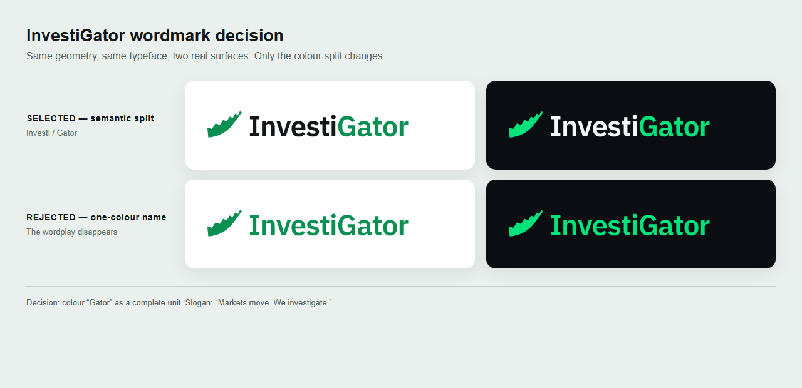

# InvestiGator — sistema de marca “The Tail”

> Adotado a 2026-07-29 e fechado como conjunto de entrega a 2026-09-03.

## Ideia

A marca é um único traço que se lê como cauda serrilhada de um jacaré e como linha de mercado
ascendente. A base espessa afina até à ponta; os dentes são simultaneamente escamas e
volatilidade. A forma diz o nome sem desenhar um animal e continua reconhecível a 16 px.

A marca anterior, “The Stare”, juntava olho, sobrolho e linha de mercado. A 16 px as formas
fundiam-se; a pupila lia-se como predador, em conflito com um produto que mostra evidência e
não recomenda uma ação. “The Tail” venceu a comparação real a 88, 44, 24 e 16 px.

## Decisão do nome

O nome escreve-se **InvestiGator**. “Investi” usa a cor de tinta e “Gator” inteiro usa o verde.
Colorir só o “G” parecia uma gralha à distância; colorir o nome todo apagava a separação
semântica. A interface e os ficheiros de entrega usam agora a mesma decisão.



## Lema

> **Markets move. We investigate.**

Substitui “Every move investigated, never predicted.”, que era longo, defensivo e pouco
distintivo. O lema novo é curto e descreve a função da marca sem prometer causa, previsão,
recomendação ou retorno. Em português: “Os mercados mexem. Nós investigamos.” A frase de
segurança do painel — “Observed past outcomes. Never a price prediction, never advice.” —
mantém-se como aviso funcional; não é o lema.

## Conjunto canónico

Cada peça existe em claro, escuro e monocromático. Os sufixos são `-dark` e `-mono`; a versão
sem sufixo destina-se a fundos claros.

| Peça | Claro | Escuro | Monocromático | Uso principal |
|---|---|---|---|---|
| Horizontal | `logo-lockup.svg` | `logo-lockup-dark.svg` | `logo-lockup-mono.svg` | cabeçalhos e capas |
| Com lema | `logo-lockup-tagline.svg` | `logo-lockup-tagline-dark.svg` | `logo-lockup-tagline-mono.svg` | capa e primeiro slide |
| Empilhada | `logo-empilhado.svg` | `logo-empilhado-dark.svg` | `logo-empilhado-mono.svg` | peças quadradas e sociais |
| Marca | `logo-marca.svg` | `logo-marca-dark.svg` | `logo-marca-mono.svg` | favicon e 16 px |
| Nome | `logo-nome.svg` | `logo-nome-dark.svg` | `logo-nome-mono.svg` | rodapés e segundo uso |

Todos vivem em `app/assets/`. O nome usa IBM Plex Sans Semibold e o lema IBM Plex Mono
Semibold, ambos convertidos em contornos. Os SVG não contêm `<text>` nem dependem de tipos de
letra instalados. A licença OFL e os WOFF2 de origem estão em `web/assets/fonts/`.

Os cinco PNG claros de 512 px estão em `app/assets/brand/png/`. O avatar do canal continua a
ser `app/assets/telegram_avatar.png`: é derivado de `icon.svg`, porque o Telegram precisa da
peça quadrada com contentor, não do empilhado transparente.

### Compatibilidade

Os nomes históricos continuam válidos:

- `logo.svg`, `logo-dark.svg` e `logo-mono.svg` mantêm a geometria original da marca;
- `logo-wordmark*.svg` são cópias geradas de `logo-nome*.svg`;
- `icon.svg` e `telegram_avatar.png` mantêm o contrato do canal;
- `logo_tail.png`, `logo_tail_icone.png` e `logo_lockup.png` continuam a ser produzidos para os
  slides e o guia antigos em `tese/figures/`.

`logo-gator-g.svg` e `logo-jaws.svg` são estudos rejeitados, não elementos do conjunto canónico.

## Paleta

| Papel | Fundo claro | Fundo escuro | Nota |
|---|---|---|---|
| Verde de marca | `#0A8F52` | `#00E37A` | símbolo e “Gator” |
| Tinta | `#14171A` | `#F3F7F5` | “Investi” e lema |
| Contentor do ícone | `#0A0E12` | `#0A0E12` | só no ícone quadrado |

O painel usa verdes ligeiramente mais escuros/contidos (`#0A7F4F` no tema claro e `#2FD07F`
no escuro) quando a cor funciona como texto ou controlo. É uma variante de acessibilidade:
o primeiro passa 4,5:1 sobre o fundo claro, ao contrário do verde reservado ao glifo. A
geometria e a separação “Investi”/“Gator” continuam iguais.

## Fonte de verdade e regeneração

`scripts/build_brand_assets.py` lê a geometria canónica e os WOFF2 locais, cria as quinze peças,
os aliases, os PNG e a folha de comparação. `scripts/render_logo.py` é um ponto de entrada
compatível que chama o mesmo gerador.

```powershell
.\.venv\Scripts\python.exe scripts\build_brand_assets.py
.\.venv\Scripts\python.exe -m pytest tests\test_brand_assets.py
```

As portas verificam XML válido, ausência de fontes, a mesma cauda no site e nos SVG, a cor das
cinco letras de “Gator”, o lema e as dimensões dos PNG.

## Onde aparece

- **Painel atual:** a cauda fica inline em `web/index.html` para herdar a cor acessível do tema;
  um teste garante que a geometria é a mesma do ativo canónico.
- **Tese e materiais:** usam PNG derivados, porque o compilador LaTeX não lê SVG diretamente.
- **Canal Telegram:** `telegram_avatar.png`, carregado pelo proprietário do canal.

## Critérios de aceitação

- [x] silhueta legível a 16 px;
- [x] cinco peças, cada uma em claro, escuro e monocromático;
- [x] nome e lema em contornos, sem dependência de fontes instaladas;
- [x] “Gator” inteiro em verde;
- [x] geometria única no ativo e no painel;
- [x] avatar RGBA de 512×512;
- [x] slogan curto, sem previsão, aconselhamento ou causalidade implícita.
